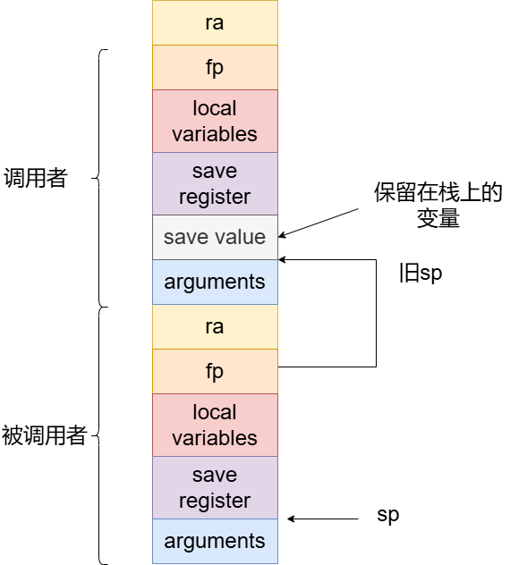

# SysYCompiler设计

## 00参考编译器介绍(PL/0 Compiler)

参考的编译器为课程组提供的`PL/0`编译器，采用`Pascal`语言书写，其编译过程主要分为词法分析、语法分析和代码生成三个步骤，此外还包含出错处理程序。

### 总体结构

* 词法分析：通过`getSym`函数从源代码中逐个字符读取，识别保留字、标识符、常量、运算符等词法单元。
* 语法分析：使用递归下降的方法，由相应的函数`block`、`statement`等实现。
* 代码生成：通过`gen`函数生成目标语言。

### 接口设计

| 名称   | 定义                           | 名称       | 定义                   | 名称      | 定义                       |
| ------ | ------------------------------ | ---------- | ---------------------- | --------- | -------------------------- |
| sym    | 存储当前读取的词法单元         | block      | 分析程序处理过程       | factor    | 因子处理                   |
| num    | 存储数值单词的值               | enter      | 新识别符号加入符号表   | condition | 条件处理                   |
| id     | 存储标识符名称                 | position   | 查找标识符在符号表位置 | interpret | 对目标代码的解释执行程序   |
| getsym | 词法分析的入口函数             | listcode   | 列出目标代码清单       | base      | 通过静态链求出数据区基地址 |
| getch  | 漏掉空格，读取一个字符         | statement  | 语句部分处理           | error     | 错误处理程序               |
| gen    | 生成目标代码，并送入目标程序区 | expression | 表达式处理             | middle     | 符号表                     |
| test   | 测试当前单词是否合法           | term       | 项处理                 | code      | 生成的指令序列             |

### 文件组织

PL/0编译器文件组织相对简单，主要包含以下几个部分：

* 主程序：编译器的入口，从源文件中读取源代码。
* 词法分析模块：`getsym`函数负责读取字符并转化为相应符号。
* 语法分析模块：通过`block`、`statement`等函数实现对`PL/0`程序的递归下降解析。
* 虚拟机代码生成：`gen`函数用于生产`PL/0`虚拟机指令，并存储在`code`数组中。
* 解释器模块：`interpret`函数负责解释和执行相应的目标代码。

## 01编译器总体设计(SysY Compiler)

本编译器为SysY语言编译器，采用`Java`语言书写，主要包括词法分析、语法分析、语义分析和中间代码生成、代码优化、生成目标代码等五个部分。

> 当前进度：项目基本完成

### 总体结构

* 词法分析阶段：从`testfile.txt`中读取源代码，将其字符转化为单词。
* 语法分析阶段：将分析得到的单词流根据文法解析成抽象语法树。
* 语义分析阶段：将抽象语法树翻译生产中间代码，包含错误处理。
* 代码优化阶段：优化中间代码，如mem2reg，DCE，GVN-GCM等。
* 目标代码生成阶段：将中间代码翻译成目标代码mips。

### 接口设计

| 名称                | 定义                                           |
| ------------------- | ---------------------------------------------- |
| sourceCode          | 以字符串形式存储的源代码                       |
| lexer               | 词法分析器                                     |
| parser              | 语法分析器                                     |
| visitor             | 语义分析器                                     |
| module              | LLVM IR的总体结构                              |
| optimizer           | 优化器                                         |
| Optimize            | 优化开关                                       |
| translator          | 目标代码翻译器                                 |
| readTestFIle()      | 从特定路径中读取源代码.txt文件 (`FileIO.java`) |
| analyzeCode()       | 词法分析阶段入口 (`Lexer.java`)                |
| analyzeTokens()     | 语法分析阶段入口(`Parser.java`)                |
| printLexerResult()  | 词法分析结果输出 (`FileIO.java`)               |
| printParserResult() | 语法分析结果输出(`FIleIO.java`)                |
| printError()        | 错误结果输出 (`FileIO.java`)                   |
| buildIR()           | 语义分析并生成中间代码入口(`Visitor.java`)     |
| printLlvmIrResult() | 中间代码结果输出(`FileIO.java`)                |
| optimizeSSA()       | 中端优化启动(`Optimizer.java`)                 |
| optimizeBackend()   | 后端优化启动(`Optimizer.java`)                 |
| genMipsCode()       | 目标代码(Mips)生成入口(`Translator.java`)      |
| printMipsCode()     | 目标代码结果输出(`FileIO.java`)                |

### 文件组织

```c
SysYCompiler
|-- src
|   |-- Compiler.java
|   |-- backend
|   |   |-- afteropt
|   |   |   `-- Translator.java
|   |   |-- beforeopt
|   |   |   |-- OldTranslator.java
|   |   |   `-- RegManager.java
|   |   `-- mips
|   |       |-- MipsData.java
|   |       |-- MipsFunction.java
|   |       |-- MipsInstrType.java
|   |       |-- MipsInstruction.java
|   |       |-- MipsModule.java
|   |       |-- MipsRegister.java
|   |       `-- StackManager.java
|   |-- config.json
|   |-- frontend
|   |   |-- Error.java
|   |   |-- Lexer.java
|   |   |-- Parser.java
|   |   |-- Token.java
|   |   |-- TokenType.java
|   |   `-- ast
|   |       |-- AddExp.java
|   |       |-- AstNode.java
|   |       |-- Block.java
|   |       |-- Character.java
|   |       |-- CompUnit.java
|   |       |-- Cond.java
|   |       |-- ConstDecl.java
|   |       |-- ConstDef.java
|   |       |-- ConstExp.java
|   |       |-- ConstInitVal.java
|   |       |-- EqExp.java
|   |       |-- Exp.java
|   |       |-- ForStmt.java
|   |       |-- FuncDef.java
|   |       |-- FuncFParam.java
|   |       |-- FuncFParams.java
|   |       |-- FuncRParams.java
|   |       |-- FuncType.java
|   |       |-- InitVal.java
|   |       |-- LAndExp.java
|   |       |-- LOrExp.java
|   |       |-- LVal.java
|   |       |-- MainFuncDef.java
|   |       |-- MulExp.java
|   |       |-- Number.java
|   |       |-- PrimaryExp.java
|   |       |-- RelExp.java
|   |       |-- Stmt.java
|   |       |-- UnaryExp.java
|   |       |-- UnaryOp.java
|   |       |-- VarDecl.java
|   |       `-- VarDef.java
|   |-- llvmir
|   |   |-- Module.java
|   |   |-- User.java
|   |   |-- Value.java
|   |   |-- ValueType.java
|   |   `-- values
|   |       |-- Argument.java
|   |       |-- BasicBlock.java
|   |       |-- Constant.java
|   |       |-- Function.java
|   |       |-- GlobalVariable.java
|   |       `-- instr
|   |           |-- Alloca.java
|   |           |-- BinaryOperator.java
|   |           |-- Branch.java
|   |           |-- Call.java
|   |           |-- Compare.java
|   |           |-- GetElementPtr.java
|   |           |-- Instruction.java
|   |           |-- Load.java
|   |           |-- Move.java
|   |           |-- Pc.java
|   |           |-- Phi.java
|   |           |-- Return.java
|   |           |-- Store.java
|   |           |-- Trunc.java
|   |           `-- Zext.java
|   |-- middle
|   |   |-- irbuilder
|   |   |   |-- SymType.java
|   |   |   |-- Symbol.java
|   |   |   |-- SymbolTable.java
|   |   |   `-- Visitor.java
|   |   `-- optimizer
|   |       |-- CFG.java
|   |       |-- DCE.java
|   |       |-- GCM.java
|   |       |-- GVN.java
|   |       |-- LiveAnalyze.java
|   |       |-- Mem2reg.java
|   |       |-- Optimizer.java
|   |       |-- RegAlloc.java
|   |       |-- RemovePhi.java
|   |       `-- SimplifyBlock.java
|   `-- utils
|       |-- FileIO.java
|       |-- SlotTracker.java
|       `-- Transform.java
|-- testfile.txt
```

##  02词法分析设计

### 类别码定义(TokenType.java)

首先将统一的单词类别码以枚举类的形式存储在`TokenType.java`中。此外还自定义了一类类别码`ANNOTATION`，表示注释。

| 单词名称    | 类别码     | 单词名称 | 类别码    | 单词名称 | 类别码 | 单词名称   | 类别码     |
| ----------- | ---------- | -------- | --------- | -------- | ------ | ---------- | ---------- |
| Ident       | IDENFR     | else     | ELSETK    | void     | VOIDTK | ;          | SEMICN     |
| IntConst    | INTCON     | !        | NOT       | *        | MULT   | ,          | COMMA      |
| StringConst | STRCON     | &&       | AND       | /        | DIV    | (          | LPARENT    |
| CharConst   | CHRCON     | \|\|     | OR        | %        | MOD    | )          | RPARENT    |
| main        | MAINTK     | for      | FORTK     | <        | LSS    | [          | LBRACK     |
| const       | CONSTTK    | getint   | GETINTTK  | <=       | LEQ    | ]          | RBRACK     |
| int         | INTTK      | getchar  | GETCHARTK | >        | GRE    | {          | LBRACE     |
| char        | CHARTK     | printf   | PRINTFTK  | >=       | GEQ    | }          | RBRACE     |
| break       | BREAKTK    | return   | RETURNTK  | ==       | EQL    | annotation | ANNOTATION |
| continue    | CONTINUETK | +        | PLUS      | !=       | NEQ    |            |            |
| if          | IFTK       | -        | MINU      | =        | ASSIGN |            |            |

### 词法单元类设计(Token.java)

```java
public class Token {
    private final TokenType type;	// 类别码类型
    private final String content;	// 单词内容（以字符串形式存储）
    private final int lineno;		// 所在行号
    ......
}
```

### 词法分析器设计(Lexer.java)

```java
public class Lexer {
    private int tokenIndex;					// 遍历器当前字符下标
    private int lineno;						// 当前行号
    private final String sourceCode;		// 源代码
    private final ArrayList<Token> tokens;	// 词法解析后的token流
    private final ArrayList<Error> errors;	// 词法解析后的errors流
    ......
}
```

### 词法分析过程设计

词法分析使用的主要成员及方法：

* `sourceCode`编译的源代码
* `tokenIndex`当前源代码中字符下标，初始为0
* `lineno`当前字符下标所属行号，初始为1

* `analyzeCode()`词法分析器执行词法分析过程的入口
* `next()`获取下一个`Token`
* `getTokens()`获得词法解析的`Token`流
* `getErrors()`获得词法解析出现的错误集

词法解析过程中先将源代码以字符串形式存储，`analyzecode`方法循环调用`next`方法，不断移动字符下标直到字符串结尾，移动过程中跳过空白符（`’  ','\n','\t'`），遇到换行符则增加`lineno`。将每次`next`方法返回的词法单元保存至`tokens`中。

针对于标识符和保留字的区分，我的设计中先构建保留词表，然后将标识符和保留字看成同一类词法单元进行解析，得到相应的字符串后，去保留词表进行匹配，若能匹配上则证明该单词属于保留字，否则为标识符。

```java
private final HashMap<String, TokenType> keywords = new HashMap<String, TokenType>() {{
    put("main", TokenType.MAINTK);
    put("const", TokenType.CONSTTK);
    put("int", TokenType.INTTK);
    put("char", TokenType.CHARTK);
    put("break", TokenType.BREAKTK);
    put("continue", TokenType.CONTINUETK);
    put("if", TokenType.IFTK);
    put("else", TokenType.ELSETK);
    put("for", TokenType.FORTK);
    put("getint", TokenType.GETINTTK);
    put("getchar", TokenType.GETCHARTK);
    put("printf", TokenType.PRINTFTK);
    put("return", TokenType.RETURNTK);
    put("void", TokenType.VOIDTK);
}};
public Token next() {
    StringBuilder sb = new StringBuilder();
    ......
    // 标识符 or 保留字
    if (isIdentNonDigit()) {
        while (isIdentNonDigit() || isDigit()) {
            sb.append(sourceCode.charAt(tokenIndex));
            tokenIndex++
        }
        if (keywords.containsKey(sb.toString())) {
            return new Token(keywords.get(sb.toString()), sb.toString(), lineno);
        }
        return new Token(TokenType.IDENFR, sb.toString(), lineno);
    }
 	......
}
```

## 03语法分析设计

### 抽象语法树设计(ast软件包)

首先设计一个接口类`AstNode`，其包含的方法只有两个：

```java
public interface AstNode {
    String getSymbol();	// 返回非终结符名称
    void printToFile(BufferedWriter bw) throws IOException;	// 将语法内容输出到文件中
}
```

再将除了`<BlockItem>`，`<Decl>`，`<BType>`之外的非终结符构建相应名称的类并实现`AstNode`这一接口。构建的思路主要有以下4种：

* 一是非终结符推导的规则唯一且非递归规则时，如Exp → AddExp，直接使`Exp`的成员变量设置为一个`AddExp`类型的字段。

  ```java
  public class Exp implements AstNode {
      private final AddExp addExp;
      public Exp(AddExp addExp) { this.addExp = addExp; }
      @Override
      public String getSymbol() { return "<Exp>"; }
      @Override
      public void printToFile(BufferedWriter bw) throws IOException {
          addExp.printToFile(bw);
          bw.write(getSymbol() + "\n");
      }
  }
  ```

* 二是非终结符推导规则唯一但含有递归规则时，首先消除左递归，例如AddExp → MulExp | AddExp ('+' | '−') MulExp，消除左递归得到AddExp → MulExp { ('+' | '−') MulExp } ，因此可以将`AddExp`成员变量看作是一个装有`MulExp`类型的容器和一个装有符号`Token`的容器。**此时要注意输出时需要按原文法规则输出**。

  ```java
  public class AddExp implements AstNode {
      private final ArrayList<MulExp> mulExps;
      private final ArrayList<Token> ops;
      public AddExp(ArrayList<MulExp> mulExps, ArrayList<Token> ops) {
          this.mulExps = mulExps;
          this.ops = ops;
      }
      @Override
      public String getSymbol() { return "<AddExp>"; }
      @Override
      public void printToFile(BufferedWriter bw) throws IOException {
          for (int i = 0; i < mulExps.size(); i++) {
              mulExps.get(i).printToFile(bw);
              bw.write(getSymbol() + "\n");
              if (i < ops.size()) { bw.write(ops.get(i) + "\n"); }
          }
      }
  }
  ```

* 三是推导规则包含多种情况的，例如用`|`连接的：PrimaryExp → '(' Exp ')' | LVal | Number | Character。此时通常会选择用一个`AstNode`类来作为成员变量，输出时再根据其实际类型修改输出格式。

  ```java
  public class PrimaryExp implements AstNode {
      private final AstNode primaryExp;
      public PrimaryExp(Exp exp) { primaryExp = exp; }
      public PrimaryExp(LVal lVal) { primaryExp = lVal; }
      public PrimaryExp(Number number) { primaryExp = number; }
      public PrimaryExp(Character character) {
          primaryExp = character;
      }
      @Override
      public String getSymbol() { return "<PrimaryExp>"; }
      @Override
      public void printToFile(BufferedWriter bw) throws IOException {
          if (primaryExp instanceof Exp) {
              bw.write(TokenType.LPARENT + " (\n");
              primaryExp.printToFile(bw);
              bw.write(TokenType.RPARENT + " )\n");
          } else if (primaryExp instanceof LVal) {
              primaryExp.printToFile(bw);
          } else if (primaryExp instanceof Number) {
              primaryExp.printToFile(bw);
          } else if (primaryExp instanceof Character) {
              primaryExp.printToFile(bw);
          }
          bw.write(getSymbol() + "\n");
      }
  }
  ```

* 四是含有`[]`或`{}`的推导规则，如： LVal → Ident ['[' Exp ']']。我选择设计多个构造函数，来对应不同的情况，如果不含有对应成员则设为`null`。

  ```java
  public class LVal implements AstNode {
      private final Token ident;
      private final Exp exp;
      public LVal(Token ident, Exp exp) { // 对应LVal → Ident
          this.exp = exp;
          this.ident = ident;
      }
      public LVal(Token ident) {			// 对应 LVal → Ident '[' Exp ']'
          this.exp = null;
          this.ident = ident;
      }
      @Override
      public String getSymbol() { return "<LVal>"; }
      @Override
      public void printToFile(BufferedWriter bw) throws IOException {
          bw.write(ident + "\n");
          if (exp != null) {
              bw.write(TokenType.LBRACK + " [\n");
              exp.printToFile(bw);
              bw.write(TokenType.RBRACK + " ]\n");
          }
          bw.write(getSymbol() + "\n");
      }
  }
  ```

  又比如FuncRParams → Exp { ',' Exp }，则直接将其成员变量设置为一组容器。

  ```java
  public class FuncFParams implements AstNode {
      private final ArrayList<FuncFParam> funcFParams;
      public FuncFParams(ArrayList<FuncFParam> funcFParams) {
          this.funcFParams = funcFParams; 
      }
      @Override
      public String getSymbol() { return "<FuncFParams>"; }
      @Override
      public void printToFile(BufferedWriter bw) throws IOException {
          funcFParams.get(0).printToFile(bw);
          for (int i = 1; i < funcFParams.size(); i++) {
              bw.write(TokenType.COMMA + " ,\n");
              funcFParams.get(i).printToFile(bw);
          }
          bw.write(getSymbol() + "\n");
      }
  }
  ```

实际上这个语法树仍然不够简洁，例如`Exp`，`Cond`等完全可以省去，但考虑其在特定情境下的语义还是有区别，因此并没有做化简。等待尝试完语义分析后再考虑化简抽象语法树。

### 语法分析器设计(Parser.java)

```java
public class Parser {
    private final ArrayList<Token> lexerCode;	// 词法解析得到的单词流
    private final ArrayList<Error> errors;		// 词法分析和语法分析出现的错误
    private int lexerIndex;						// 单词流指针
    private CompUnit compUnit;					// 语法分析解析得到的抽象语法树顶
}
```

### 递归下降法分析语义

主要方法：

* `analyzeTokens()`语法分析入口
* `sym()`获取当前指针指向的单词
* `nextSym()`移动指针
* `getCompUnit()`获取语法分析得到的抽象语法树
* `parse*()`递归下降解析的方法，其中*表示各种非终结字符

特殊的分析方法如下：

1. 消除左递归：

   ```c
   乘除模表达式 MulExp → UnaryExp | MulExp ('*' | '/' | '%') UnaryExp 
   改写：MulExp → UnaryExp {('*' | '/' | '%') UnaryExp}
   加减表达式 AddExp → MulExp | AddExp ('+' | '−') MulExp
   改写：AddExp → MulExp {('+' | '−') MulExp}
   关系表达式 RelExp → AddExp | RelExp ('<' | '>' | '<=' | '>=') AddExp
   改写：RelExp → AddExp {('<' | '>' | '<=' | '>=') AddExp}
   相等性表达式 EqExp → RelExp | EqExp ('==' | '!=') RelExp
   改写：EqExp → RelExp {('==' | '!=') RelExp}
   逻辑与表达式 LAndExp → EqExp | LAndExp '&&' EqExp 
   改写：LAndExp → EqExp {'&&' EqExp} 
   逻辑或表达式 LOrExp → LAndExp | LOrExp '||' LAndExp
   改写：LOrExp → LAndExp {'||' LAndExp}
   ```

2. 超前看：

   可以采用超前看的策略的规则如下：

   CompUnit → {Decl} {FuncDef} MainFuncDef，可以抢先看`sym(2)`是否为`main`，来判断是否含`Decl`或`FuncDef`，再根据是否含`(`判断是否含`FuncDef`。

   UnaryExp → PrimaryExp | Ident '(' [FuncRParams] ')' | UnaryOp UnaryExp，通过超前看`sym(2)`是否为左括号`(`来判断是否为UnaryExp → Ident '(' [FuncRParams] ')' 。

3. 回溯：

   例如`Stmt`判断'return' [Exp] ';' 后是否包含`Exp`时，由于考虑`i`型错误的存在不能通过判断下一个字符是否为`;`来判断是否含`Exp`，因此可以采用先解析`Exp`，如果解析成功则继续解析，如果失败则回溯。

   又例如区分`Stmt`开头符号是`LVal = `还是`Exp`时也是采取了先解析`LVal`，如果解析完下一个单词不是`=`则回溯。

   自定义一个枚举字段`myError`，用于判断是否需要回溯。例如`LVal`解析时如果第一个单词不是`IDENFR`则抛出`Error`类型异常。

## 04错误处理设计

> 编码前设计

### 错误类型码定义(Error.java)

```java
public class Error {
    private final ErrorType type;	// 错误类型码
    private final int lineno;		// 错误行号

    public enum ErrorType {
        a, b, c, d, e, f, g, h, i, j, k, l, m, myError;
    }
}
```

### 错误发现过程

* 词法分析阶段：a类错误，出现单独的`&`和`|`两个符号。

* 语法分析阶段：i类错误，缺少分号；

  ​						   j类错误，缺少右小括号；

  ​						   k类错误，缺少右中括号。

* 语义分析阶段：其他错误

## 05代码生成设计

### 符号设计

```java
public class Symbol {
    private final String name;
    private final SymType type;
    private Value value;	// 对应一个LLVM的Value
    private final int depth;
    private final int lineno;
    private FuncFParams funcFParams;
```

其中SymType表示数据类型（int/char）和变量类型（array/const/function）,depth是所在符号表的深度。

### 符号表设计

```java
public class SymbolTable {
    private final LinkedHashMap<String, Symbol> symItems;
    private SymbolTable fatherTable;
    private final ArrayList<SymbolTable> children;
    private final int depth;
```

用一张哈希表存储符合表的表项（即符号Symbol），同时维护一个树状符号表结构。

### 符号表查询

先在当前表中查询，如果查找不到，则向上查找符号表树的父结点表。

```java
public Symbol findSym(String name, String type) {
    if (symItems.containsKey(name)) {
        Symbol symbol = symItems.get(name);
        if (symbol.getName().equals(name) && symbol.getVarOrFunc().equals(type)) {
            return symbol;
        }
    }
    if (fatherTable != null) {
        return fatherTable.findSym(name, type);
    }
    return null;
}
```

### 中间代码生成

#### LLVM设计

中间代码我采用的LLVM IR，构建了定义-使用的关系

简单来说，基本类是Value，User类继承Value类，可以“使用”其他Value。Value中构建一个成员usersList，用来保存所有被使用的value；User中构建一个成员operands，用来保存使用的所有Value。这样，一个User能通过operands知道自己使用了哪些Value，一个Value也能通过usersList知道自己被哪些User所使用。这样的结构省去了Use这样的结构，更简洁更清晰。定义-使用关系的构建发生在User添加一个Value作为操作数时：

```java
public void addOperands(Value value) {
    operands.add(value); // 使用这个value作为操作数
    if (value != null) {
        value.addUser(this); // value被自己使用
    }
}
```

除此之外我还定义了Argument(参数)，BasicBlock(基本块)，Constant(常数)，Function(函数)，GlobalVariable(全局变量)，Instruction(指令)。其中指令继承User，其他继承自value。

Instruction又分为一些LLVM的指令，全部继承自Instruction。


#### 语义分析 生成中间代码

visitor类用于完成语义分析并生成中间代码，其逻辑与递归下降类似。

主要分为两个核心功能：构建符号表，生成中间代码。构建符号表的逻辑是每当进入一个Block时，就新建一张符号表，并将符号表添加进符号表树。

生成中间代码的细节比较复杂，无法一一详细讲述，比较有意思的设计点是我在生成中间代码的时候就实现了部分常量传播和常量折叠。

例如在生成加减乘除和取余的中间代码时：

```java
public Value getBinInstr(Value value1, Value value2, Type type) {
    if (value1 == null || value2 == null) {
        return null;
    }
    if (value1 instanceof Constant && value2 instanceof Constant) {
        return calConst((Constant) value1, (Constant) value2, type);
    } else {
        Value zextValue1 = zext(value1);
        Value zextValue2 = zext(value2);
        BinaryOperator binOp = new BinaryOperator(
            new ValueType.Type(Integer32Ty), type, "");
        binOp.addOperands(zextValue1);
        binOp.addOperands(zextValue2);
        curBasicBlock.appendInstr(binOp, true);
        return binOp;
    }
}

public Constant calConst(Constant value1, Constant value2, Type type) {
    switch (type) {
        case ADD:
            return new Constant(Integer.toString(Integer.parseInt(value1.getName())
                                                 + Integer.parseInt(value2.getName())));
        case SUB:
            return new Constant(Integer.toString(Integer.parseInt(value1.getName())
                                                 - Integer.parseInt(value2.getName())));
        case MUL:
            return new Constant(Integer.toString(Integer.parseInt(value1.getName())
                                                 * Integer.parseInt(value2.getName())));
        case SDIV:
            return new Constant(Integer.toString(Integer.parseInt(value1.getName())
                                                 / Integer.parseInt(value2.getName())));
        case SREM:
            return new Constant(Integer.toString(Integer.parseInt(value1.getName())
                                                 % Integer.parseInt(value2.getName())));
        default:
            return null;
    }
}
```

### 目标代码生成

#### 优化前设计

在实现优化之前，我设计的中间代码到mips时内存-寄存器的翻译模式映射的。由于我的中间代码设计几乎保证了每个Value只被使用一次，因此我的寄存器分配策略采取的是最简单的寄存器池分配，即

* 如果寄存器池不空，则分配一个临时寄存器。
* 如果该Value被使用过一次，则当即释放寄存器。
* 如果寄存器池已空，选择一个已分配寄存器的变量v，把v放回栈上，v释放的寄存器分配给其他变量。

运行栈的设计是借鉴了mips的标准运行栈，我的设计如下：

```java
/**
 * ra 
 * fp 
 * local variables(局部变量) 
 * save register
 * arguments
 */
private StackManager() {
    stackPtr = 0;	// 栈指针
    stackFrameMap = new HashMap<>();	// 维护变量名->栈内偏移量关系
}
```

翻译mips的过程中，每进入一个函数，就开辟一段栈空间设置为函数的栈帧，这段栈帧从高地址到低地址依次为ra寄存器值，fp寄存器值（存放调用者的sp），需要保存的局部变量，需要保存的寄存器，以及**传递给子函数**的函数参数。**注意**在我设计的栈帧中，arguments并不是该函数的参数，而是用于传递给子函数参数而开辟的空间。**那函数自身参数存储在哪里呢？**只需要访问**调用者**的函数栈帧的arguements段即可（其中前四个参数直接访问\$a0-\$a3即可）。

之前提到的寄存器不够时，要随机选择一个寄存器将旧值放到栈上，然后释放这个寄存器给新的变量使用。那么如果真的在翻译过程中出现这种情况，一定是需要移动sp指针的。而如果函数的sp默认指向arguments的最低地址，那么此时如果向下移动了sp，那么函数传参的偏移量位置就会出错，子函数从本来应该是argument的地址获得的却是被保存在栈上的临时变量。因此我的做法是**将sp指针指向arguments最高地址上方**，即传递参数给子函数时，永远是访问sp指针以下的区域。



遇到函数调用时(call)，先保存现场，将尚未被释放的寄存器存入栈中对应位置，接着传递函数参数，前四个直接move到\$a0-\$a3，其他放入栈帧中arguments段，然后跳转到函数即可。从函数返回后要恢复现场，并获取返回值（默认保存在\$v0）。

其他mips代码的翻译采取逐行对应翻译，唯一特殊的是跳转指令的翻译设计。对于条件跳转来说，往往br的上一条是一个icmp指令，如果逐句翻译那最少需要两条mips指令；我的选择是不单独翻译icmp，而是结合br一起翻译成一条mips是跳转指令。

```java
public void genBranchInstr(Compare judge, BasicBlock target) {
    Value value1 = judge.getOperands().get(0);
    Value value2 = judge.getOperands().get(1);
    MipsRegister op1 = getReg(value1);
    MipsRegister op2 = getReg(value2);
    MipsInstruction branch;
    switch (judge.getCondType()) {
        case NE:
            branch = new MipsInstruction(
                BNE, op1.getName(), op2.getName(), target.getLabel());
            break;
        case EQ:
            branch = new MipsInstruction(
                BEQ, op1.getName(), op2.getName(), target.getLabel());
            break;
        case SGE:
            branch = new MipsInstruction(
                BGE, op1.getName(), op2.getName(), target.getLabel());
            break;
        case SLE:
            branch = new MipsInstruction(
                BLE, op1.getName(), op2.getName(), target.getLabel());
            break;
        case SGT:
            branch = new MipsInstruction(
                BGT, op1.getName(), op2.getName(), target.getLabel());
            break;
        case SLT:
            branch = new MipsInstruction(
                BLT, op1.getName(), op2.getName(), target.getLabel());
            break;
        default:
            branch = new MipsInstruction(NOP);
    }
    currentFunction.addInstr(branch);
}
```

#### 优化后设计

优化后的寄存器分配采用了线性扫描的寄存器分配办法，完成活跃变量分析后，设置一个寄存器池。从函数的入口基本块开始，遍历每条IR指令对应的变量：

* 初始化一个集合，包含IR指令的使用和定义（对于llvm来说，类似store, br等都是不含有变量定义，只含有变量使用的）
* 对集合中每个变量都尝试分配寄存器：如果尚未被分配过且寄存器池还有剩余，那么就分配一个寄存器；如果寄存器池已经空了，则将该变量标记为放入**内存**上。如果已经被分配了，则检查该基本块后续是否还用到该变量或者该变量是否跨基本块活跃，若不是则可以释放掉寄存器。

```java
// 已经分配寄存器,检查是否可以释放
if (value2reg.containsKey(value)) {
    if (canFree(value)) {
        int reg = value2reg.get(value);
        removed.add(reg);
    }
    return;
}
// 分配寄存器
if (!freeRegsPool.isEmpty()) {  // 如果寄存器池不为空则直接分配
    int reg = freeRegsPool.remove(0);
    value2reg.put(value, reg);
    reg2Value.put(reg, value);
} else {    // 无法分配寄存器，需要放到栈上
    value2Stack.add(value);
}
```

* 释放寄存器逻辑：

```java
private boolean canFree(Value value) {
    if (currentBlock.getOuts().contains(value)) {	// 跨基本块活跃，不能释放
        return false;
    }
    // 检查该基本块的后续指令，instrPos指向的是当前指令
    for (int i = instrPos + 1; i < currentBlock.getInstructions().size(); i++) {
        if (currentBlock.getInstructions().get(i).use().contains(value)
            || value.equals(currentBlock.getInstructions().get(i).def())) {
            return false;
        }
    }
    return true;
}
```

具体细节可查看优化文档。

## 06代码优化设计

我实现的优化主要包括mem2reg（包括必要的消除Phi），死代码删除（DCE）,GVN-GCM，线性扫描寄存器分配。具体实现可查看优化文档。

优化分为两步，第一步是中端优化，第二步是后端优化。

```java
public void optimizeSSA() {
    simplifyBlock.removeDeadBlocks();
    cfg.buildCFG();     // 构建CFG
    mem2reg.buildSSA(); // 实现SSA
    dce.dce();          // 删除死代码
    cfg.buildCFG();
    gvn.gvn();          // GVN
    gcm.gcm();			// GCM
}

public void optimizeBackend() {
    activeAnalyze.analyzeActiveVar();   // 活跃变量分析
    regAlloc.regAlloc();                // 线性扫描分配寄存器
    removePhi.removePhi();              // 消除phi
    genNeighbour();
}
```

