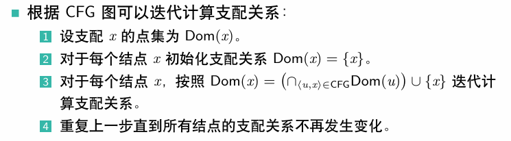
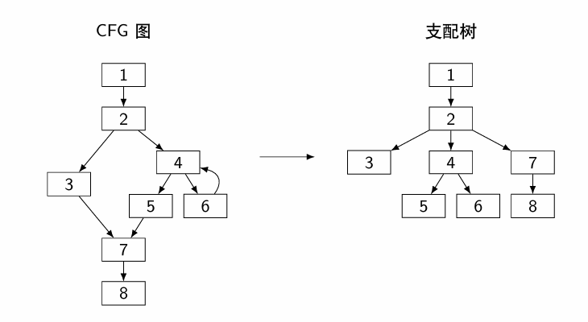
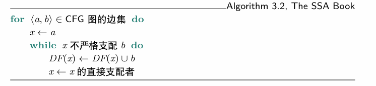
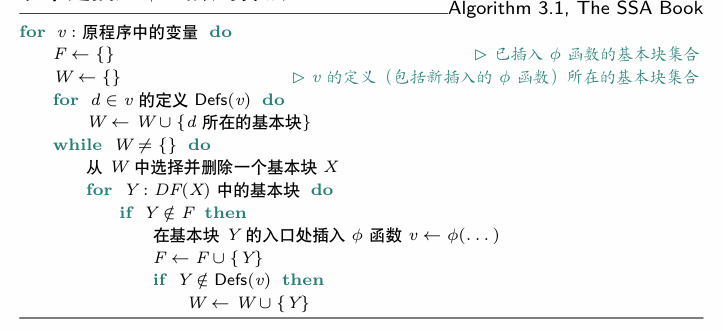
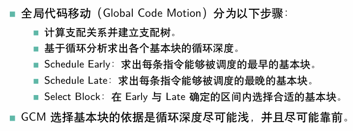
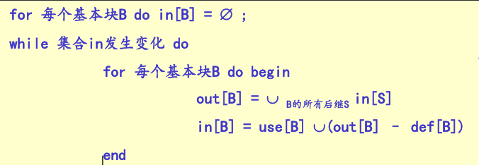
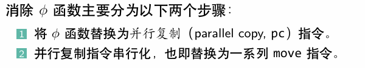
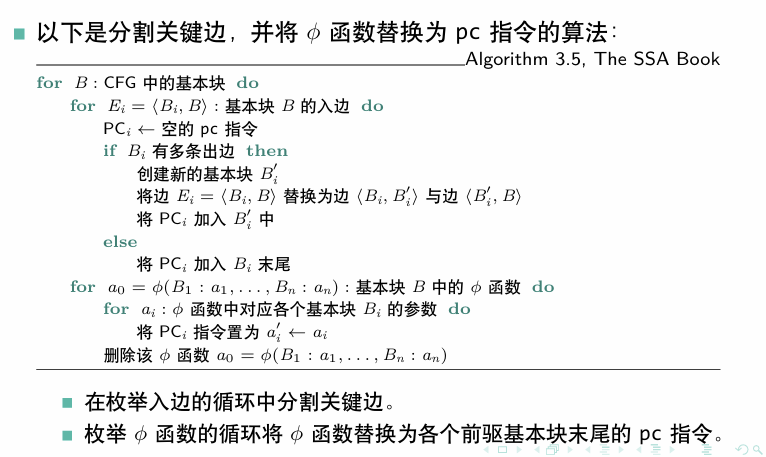
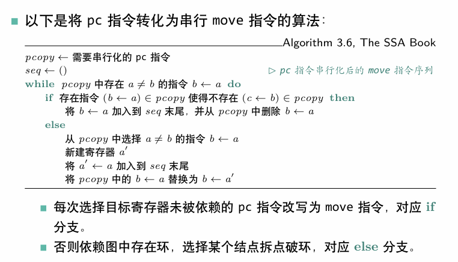

# 优化文档

## 中端优化

中端主要实现的优化包括mem2reg，DCE，GVN-GCM，下面将逐个介绍我的优化思路

## CFG图分析

### 构建CFG

控制流图（Control Flow Graph）描述了程序执行的流程，构建CFG图是后续优化的前提，因此这一步发生在优化开始前和优化过程中，目标是构建出基本块间的CFG图。每当基本块之间的关系发生变动时都需要重新构建CFG图。

简单来说CFG图就是以各个基本块为结点，每当有Branch指令跳转到其他基本块时就在两个基本块之间添加一条有向边。具体来说就是维护两个HashSet: precursor(表示前驱结点)和subsequents(后继结点)即可。

```java
public void addPreBlock(BasicBlock basicBlock) {	// basicBlock -> this
    precursor.add(basicBlock);  
    basicBlock.addSubBlock(this);
}
```

我构建CFG的过程发生在生成中间代码时，当添加一条Branch指令时就添加两个基本块之间的有向边，后续基本块变更时始终维护precursor和subsequents即可。

```java
if (instr instanceof Branch) {	// Branch有直接跳转和条件跳转两种类型
    Branch branch = (Branch) instr;
    if (branch.getOperands().size() == 1) {
        ((BasicBlock) branch.getOperands().get(0)).addPreBlock(this);
    } else if (branch.getOperands().size() == 3) {
        ((BasicBlock) branch.getOperands().get(1)).addPreBlock(this);
        ((BasicBlock) branch.getOperands().get(2)).addPreBlock(this);
    }
}
```

### 支配分析

* 首先是**计算支配关系**：

  > 若CFG中从入口到基本块y的所有路径都经过x，则称x是y的必经结点，或者称x支配（dominate）y。

  获得支配关系是分享CFG的主要核心，直接影响mem2reg以及GCM等多处优化。计算支配关系的算法如下：

  

  算法是这样没错，实际操作时我进行了如下调整：

  * 初始化Dom集合时，每个函数的第一个基本块First初始化为**First本身**，其他基本块Dom集初始化为**所有基本块**（为了方便使用 retainAll 方法计算交集）；

  * 计算支配关系的过程是一个标准的求不动点问题。设置一个初始为*false*的布尔类型的标准位*changed*，当结点Dom集有更新时*changed=true*。只要*changed*为真则始终循环；

  * 更新支配关系的方法就是将前驱基本块的Dom集取交集，再添加自身。

    ```java
    HashSet<BasicBlock> dom = new HashSet<>(function.getBasicBlocks());	// 当前结点Dom
    for (BasicBlock pre: block.getPrecursor()) {
    	dom.retainAll(pre.getDom());
    }
    dom.add(block);
    ```

* 接下来是**计算直接支配**：

  > 若x支配y，且x$\neq$y，则称x严格支配（strictdominate）y。
  >
  > 若x严格支配y，并且不存在被x严格支配同时严格支配y的结点， 则称x是y的直接支配者（immediate dominator）

  这句话看着有点绕，**实际上，结点y的直接支配者x即是y在支配树上的父结点**。

  > 如果x严格支配y，则让x成为y的祖先。通过这种方式能让支配关系唯一地确定一个树状结构，这即是支配树。支配树的根结点是CFG图的入口结点。
  >
  > 

  而一种简单有效得到支配树的方法是遍历所有严格支配y的结点x，|Dom(x)|最大的即是y在支配树上的父结点（数学原理很简单，此处不再展开）。

  ```java
  int maxDom = 0;
  for (BasicBlock block: dom) {
      if (!block.equals(this)) {	// 判断是否是严格支配
          if (block.getDom().size() > maxDom) {
              maxDom = block.getDom().size();
              iDom = block;	// 直接支配者用iDom表示
          }
      }
  }
  ```

* **计算支配边界**：

  支配边界的计算主要是为了mem2reg服务。

  > 若结点n不严格支配结点x，但严格支配x的一个前驱结点，则x 在n的支配边界DF(n)中。
  >
  > 结点n的支配边界DF(n)是所有满足以上条件的点x构成的集合。
  >
  > 结点集合S的支配边界DF(S)=$\cup_{n \in S}$DF(n)。

  简单来说，所谓结点n的支配边界就是结点n**刚刚开始支配不到的结点集合**，所以n最多只能支配到DF(n)中结点的前驱结点。

  计算支配边界的算法如下：

  

  我的具体实现也如算法所示：对于每个结点b，遍历它的前驱结点a，如果a不严格支配b，说明b一定在a的支配边界中了，于是将b添加进DF(a)中。然后继续沿着a的支配树父结点向上更新a（记得吗，**支配树的父结点就是直接支配者**），迭代判断b是否属于新a的支配边界，直到a严格支配b，此时a再继续向上迭代的父结点也一定严格支配b，于是退出循环。

* **计算支配深度**：

  支配深度是指结点在**支配树**中的深度，为了GCM优化使用（不实现GCM可以跳过这一步）。

  做法也很简单，从根结点开始前序遍历支配树即可，不再赘述。

  ```java
  private void calDomDepthForFunc(BasicBlock first, int depth) {
      first.setDomDepth(depth);
      for (BasicBlock next: first.getDomChild()) {
          calDomDepthForFunc(next, depth + 1);
      }
  }
  ```

## mem2reg

关于什么是**SSA**，什么是$\phi$**函数**，此处就不再赘述了。

之前我们实现的中间代码生成是采用了将变量全部通过**Alloca**指令申请内存，通过**Load**和**Store**来访问和修改变量的值。**mem2reg**优化的目的是将仅被**Load**指令和**Store**指令引用的**Alloca**指令提升为虚拟寄存器。如下示例：

```c
// 源代码
int main() {
    int x, a = 1;
    if (a > 1) {
        x = 1;
    } else {
        x = 0;
    }
    printf("%d", x);
    return 0;
}
```

```
; mem2reg优化前
declare void @putint(i32)

define dso_local i32 @main() {
; next = %5, %6, 
	%1 = alloca i32
	%2 = alloca i32
	store i32 1, i32* %2
	%3 = load i32, i32* %2
	%4 = icmp sgt i32 %3, 1
	br i1 %4, label %5, label %6
5: 
; pred = %0, 
; next = %7, 
	store i32 1, i32* %1
	br label %7
6: 
; pred = %0, 
; next = %7, 
	store i32 0, i32* %1
	br label %7
7: 
; pred = %5, %6, 
	%8 = load i32, i32* %1
	call void @putint(i32 %8)
	ret i32 0
}
```

```
; 仅实现mem2reg优化后
declare void @putint(i32)

define dso_local i32 @main() {
; next = %2, %3, 
	%1 = icmp sgt i32 1, 1
	br i1 %1, label %2, label %3
2: 
; pred = %0, 
; next = %4, 
	br label %4
3: 
; pred = %0, 
; next = %4, 
	br label %4
4: 
; pred = %2, %3, 
	%5 = phi i32 [ 1, %2 ], [ 0, %3 ]
	call void @putint(i32 %5)
	ret i32 0
}
```

可以明显看出执行语句变少了，而且本身load和store指令的执行周期就比一般指令长，因此mem2reg优化的意义是相当大的。

mem2reg的过程可以大致分为两步：**插入phi函数**和**变量重命名**。

### 插入phi函数

插入phi函数要解决的是来自不同前驱的变量取值问题，因此需要我们找到必要插入phi函数的结点。这时候就需要结合我们中间代码是一个**SSA**形式的性质了：**定义（结点）是引用（结点）的必经结点**。

也就是说，如果$v$被基本块中的一个$\phi$函数$\phi(n:v,···)$ 引用，那么$v$的定义结点是基本块$n$的必经结点；如果$v$被基本块不是$\phi$的语句引用，那么$v$的定义结点是这个基本块的必经结点。这里的必经结点，就是**支配**的概念。

> x是y的必经结点 $\iff$ x支配（dominate）y。

插入phi函数的算法如下：



可以看到我们需要知道每个变量的定义点，在没实现mem2reg之前，变量的定义点**Defs**就是**Alloca**和**Store**指令，变量的使用点**Uses**就是**Load**指令。因此插入phi函数之前我们需要构建每个变量的**Defs**和**Uses**的哈希表。

算法实现如下：

```java
HashSet<BasicBlock> f = new HashSet<>();    // 需要插入phi的基本块集合
HashSet<BasicBlock> w = new HashSet<>(defs.get(value)); // value的Defs所在基本块
while (!w.isEmpty()) {
    BasicBlock block = null;
    // 选择一个基本块block
    for (BasicBlock basicBlock: w) {
        block = basicBlock;
        break;
    }
    // 遍历block的支配边界
    for (BasicBlock y: block.getDF()) {
        if (!f.contains(y)) {
            // 插入phi;
            Phi phi = y.insertPhi(value);
            f.add(y);
            if (!defs.get(value).contains(y)) {
                w.add(y);
            }
            // 维护变量的defs和uses哈希表
            useInstrs.get(value).add(phi);	
            defInstrs.get(value).add(phi);	// phi即是变量使用点，也算定义点
        }
    }
    w.remove(block);
}
```

### 变量重命名

虽然这一步的名字叫变量重命名，但我认为更适合理解的叫法叫做**消除Alloca Load Store**(可能因为这个名字太长了)。

我的做法是维护一个**defStack**，栈顶保存变量value的最新定义点（注意，包括**Phi**指令）。

从CFG入口基本块开始**前序遍历**支配树中的子节点（因为如果有phi函数引用了该变量，那么该基本块一定支配phi函数所在基本块）逐个进行变量重命名。

变量重命名的具体做法分为两种情况，其一是将所有非**Phi**的使用点替换成最新的定义点；其二是将**Phi**函数中引用的最新定义点及定义点所在基本块添加进**Phi**指令：

```java
for (Instruction instr: block.getInstructions()) {
    if (useInstrs.get(value).contains(instr) && !(instr instanceof Phi)) {
        Value def = defStack.peek();
        instr.replaceAllUses(def);
    }
}
for (BasicBlock basicBlock: block.getSubsequents()) {
    for (Instruction instr: basicBlock.getInstructions()) {
        if (instr instanceof Phi && useInstrs.get(value).contains(instr)) {
            ((Phi) instr).replaceValue(defStack.peek(), block);	// 这个函数表示将引用加入Phi
        } else {
            break;
        }
    }
}
```

**记得如果在该基本块有过defStack的入栈，那么在对该基本块为根结点的子树进行过变量重命名后，将入栈的定义全部出栈，因为遍历其他子树时，这些定义点是不支配其他子树的基本块的**

```java
/* 变量重命名过程 */
// 然后前序遍历
for (BasicBlock next: block.getDomChild()) {
    DfsRename(defStack, next, value);
}
for (int i = 0; i < cnt; i++) {	// cnt表示该基本块入栈的新定义点个数
    defStack.pop();
}
```

至此，mem2reg就已经全部实现了。

## 死代码删除（DCE）

死代码删除是指删除不活跃的变量，删除定义它的指令。

我们初步认为，br，call，store，ret是必要的活跃指令，将这些指令加入活跃指令集。然后对于每个活跃指令集的指令，遍历它使用的变量（操作数），如果变量是一条赋值指令且不在活跃指令集中，那么就将这个变量的定义指令加入活跃指令集中。重复操作直到集合不变。

最后将所有不在活跃指令集中的指令从基本块中删除，删除的同时注意def-use链的维护。

**注意：**这样的方法在实现mem2reg之后才会有明显改善，因为在实现mem2reg之前修改一个变量的值都是需要Store的，这些Store会被判断成必要指令，但如果这些变量从来没有被Load出来使用过，这些Store以及相关的计算指令本质上都是不活跃的。

当然还有更为激进的死代码删除的方法，比如对于call指令来说，如果调用的函数是**无副作用**的，且函数的返回值（如果有的话）未被使用过，理论上也可以将这条指令删除。**无副作用**的函数是指不会影响内存和IO操作的函数。但实际操作后并没有对测试点指令数减少有明显改善（代码生成二还多WA了两个点，所以不敢加了555）。

## GVN-GCM

GVN(Global Variable Numbering) 全局值编号：为全局的变量进行编号，实现全局的消除公共表达式。

GCM(Global Code Motion) 全局代码移动：根据Value之间的依赖关系，将代码的位置重新安排，从而使得一些不必要（不会影响结果）的代码尽可能少执行。

看很多教程都建议GVN后接GCM，这样可以增加GVN的正确性（避免定义在引用之后），实际上我在实现GVN时采用**前序遍历支配树**的方法，可以单独有效实现GVN。

在GVN的操作中，我还同时实现了常量传播和常量折叠。

### GVN

如果两条指令的操作类型和操作数完全一致，那么实际上两条指令就是重复的，是可以删去一条的。简单来说就是给那些无副作用的计算或者比较指令计算一个Hash值，Hash值相同的指令可以被替换成一个公共的指令掉，从而实现公共子表达式删除。

我主要处理的函数包括计算指令（加减乘除、取余），icmp指令以及getelementptr指令。

```java
public String hash(String type, Value operand1, Value operand2) {
	return type + " " + operand1.getFullName() + " " + operand2.getFullName();
}
```

**注意**对于$+、*、=、\neq$这些符号来说，操作数的位置是可以替换的，因此要固定操作数顺序的规则（如按字符串进行排序），再计算哈希值。

对于getelementptr:

```java
StringBuilder sb = new StringBuilder();
sb.append(Instruction.Type.GETPTR).append(" ");
for (Value value: instruction.getOperands()) {
    sb.append(value.getFullName()).append(" ");
}
return sb.toString();
```

消除公共子表达式的方法则是针对上述三种情况的指令，计算哈希值并填入表；如果表中已有，说明这条指令是重复的，那么就进行公共子表达式替换：由于中间代码的SSA性质，需要将被替换的指令的所有引用替换成为新引用。

```java
public void replaceAllUses(Value newValue) {
    for (User user: usersList) {	// userList是所有使用该指令作为引用（操作数）的指令
        user.replaceValue(newValue, this);	//
    }
}

public void replaceValue(Value newValue, Value oldValue) {
    for (int i = 0; i < operands.size(); i++) {
        if (operands.get(i).equals(oldValue)) {
            operands.set(i, newValue);
            newValue.addUser(this);
        }
    }
}
```

与**变量重命名**类似，我的GVN过程采用从支配树根结点开始，前序遍历每个支配树的子结点，在这个子树完成公共子表达式删除后，将表中该基本块新定义的表达式哈希值从表中移除，这样再遍历其他子树时不会影响其他子树替换指令后的正确性，理论上可以不用使用GCM也能保证正确性。

```java
/* 公共子表达式删除过程 */
// 然后前序遍历
for (BasicBlock basicBlock: block.getDomChild()) {
    gvnForBlock(basicBlock);
}
for (Instruction instruction: removeSet) {
    gvnHashMap.remove(genHash(instruction));
}
```

### 常量传播和常量折叠

在生成中间代码是，我曾经实现了部分的常量传播+常量折叠。简单来说就是在建立符号表时，如果变量是常量，那么存入符号表的llvm.Value就是一个Constant类型的常数值，这样生成中间代码时就会直接引用常数值。然后如果中间代码的计算指令或比较指令的操作数都是常数，那么就可以手动计算结果并将这个常数值赋值给变量，减少指令开销。

在实现mem2reg之后，会诞生新的可常量折叠的指令，可以在GVN操作的同时再次实现常量折叠，将所有该指令的引用替换为常数。

### GCM

GCM的实现步骤大致如下：



实际上我采用的算法是：

* 重新构建支配树

* 计算不动指令集pinned：包括call,store,load,phi,br,ret

* Schedule Early：分析每条指令，如果是不动指令，则分析其操作数；如果不是不动指令，则进行Schedule Early的分析。

  **注意**：Schedule Early分析的前提一定是其**操作数都已经完成early调度**，因为我们不能让指令的early在操作数的前面，因此如果出现操作数的early在指令之后，则需要将指令的early拉回到与操作数相同深度。
  
  ```java
  if (earlyMap.get(o).getDomDepth() > earlyMap.get(instruction).getDomDepth()) {
      earlyMap.put(instruction, earlyMap.get(o));
  }
  ```
  
* Schedule Late：late调度对指令的所有use在支配树中计算最低共同祖先（LCA）， 即为指令最后一个合法的位置。与Schedule Early的不同之处在于，我们不能让变量的定义晚于变量的使用，因此我们要先计算使用该变量作为操作数的指令（即指令的**User集合**）的最晚调度基本块Late。

  **注意**，计算LCA时，如果指令是Phi指令，由于Phi总是在进入基本块的时刻并行赋值，那么应该计算Phi引用变量的前驱基本块的LCA（否则如果用Phi所在基本块计算LCA，很可能指令被移动到Phi所在基本块，但是这样就会出现Phi先于指令执行，即**使用在定义之前**）。

  ```java
  if (o instanceof Phi) {
      HashSet<BasicBlock> userBlocks = ((Phi) o).getPreBlockFromInstr(instruction);
      for (BasicBlock userBlock: userBlocks) {
          lca = findLCA(lca, userBlock);
      }
  } else {
      lca = findLCA(lca, o.getParent());
  }
  ```

  计算LCA的算法很简单，两个结点先沿着支配树到达同一支配深度，如果此时基本块仍然不同，就同时向上移动直到到达同一基本块，这个基本块就是LCA（最低共同祖先）。

* Select Block：选择基本块的依据是在Early和LCA之间且**循环深度尽可能浅**的基本块。由于移动一条指令后，会对其他指令的合法区间产生影响，因此在对一条指令完成**Schedule Late调度后随即确定最终的位置并移动**。

  ```java
  BasicBlock best = lca;
  while (lca != earlyMap.get(instruction)) {	// 从LCA向上直到Early
      lca = lca.getiDom();
      if (lca == null) {
          break;
      }
      if (lca.getLoopDepth() < best.getLoopDepth()) {
          best = lca;
      }
  }
  lateMap.put(instruction, best);	// lateMap存储的实际上就是目标基本块
  if (best != null && !lateMap.get(instruction).equals(instruction.getParent())) {
      /* 移动指令到目标基本块lateMap.get(instruction) */
  }
  ```

## 后端优化

后端主要包括的优化就是寄存器分配，以及由于实现mem2reg所带来的消除Phi。

## 寄存器分配

我采取的寄存器分配策略是线性扫描分配寄存器，相比于图着色法需要反复构建冲突图，线性扫描由于只需要遍历一遍基本块就能实现，因此分配过程很高效。由于消除Phi之后会破坏SSA，因此选择在**消除Phi之前**完成寄存器分配。

首先是活跃变量分析，计算基本块的in和out。



完成活跃变量分析后，设置一个寄存器池。从函数的入口基本块开始，遍历每条IR指令对应的变量：

* 初始化一个集合，包含IR指令的使用和定义（对于llvm来说，类似store, br等都是不含有变量定义，只含有变量使用的）

* 对集合中每个变量都尝试分配寄存器：如果尚未被分配过且寄存器池还有剩余，那么就分配一个寄存器；如果寄存器池已经空了，则将该变量标记为放入**内存**上。如果已经被分配了，则检查该基本块后续是否还用到该变量或者该变量是否跨基本块活跃，若不是则可以释放掉寄存器。

  ```java
  // 已经分配寄存器,检查是否可以释放
  if (value2reg.containsKey(value)) {
      if (canFree(value)) {
          int reg = value2reg.get(value);
          removed.add(reg);
      }
      return;
  }
  // 分配寄存器
  if (!freeRegsPool.isEmpty()) {  // 如果寄存器池不为空则直接分配
      int reg = freeRegsPool.remove(0);
      value2reg.put(value, reg);
      reg2Value.put(reg, value);
  } else {    // 无法分配寄存器，需要放到栈上
      value2Stack.add(value);
  }
  ```

* 释放寄存器的逻辑：

  ```java
  private boolean canFree(Value value) {
      if (currentBlock.getOuts().contains(value)) {	// 跨基本块活跃，不能释放
          return false;
      }
      // 检查该基本块的后续指令，instrPos指向的是当前指令
      for (int i = instrPos + 1; i < currentBlock.getInstructions().size(); i++) {
          if (currentBlock.getInstructions().get(i).use().contains(value)
              || value.equals(currentBlock.getInstructions().get(i).def())) {
              return false;
          }
      }
      return true;
  }
  ```

* **注意**：给phi分配寄存器时，由于phi是并行赋值，转换成move后可能会有错误，例如：

  ```mips
  addi v1 v0 1
  move v3 v2
  move v4 v1
  ```

  假设v3是个Phi，那么v1是有可能与v3分配同一个寄存器的，这样就会导致v3的值把v1覆盖掉。我选择的一了百了的方法是不给Phi分配寄存器。

## 消除Phi



### Phi 变 Pc

pc并不存在与LLVM IR中，因此需要自己构造一个pc指令。其格式如下：

```
v3 v2 = pc v1 v0
```

其含义表示**同时**进行赋值v3$\leftarrow$v1，v2 $\leftarrow$ v0。

Phi是插入在基本块开头，而Pc是插入到前驱基本块的结尾。

注意插入Pc是确保每个前驱基本块和后继之间只有一个Pc。如果前驱基本块$u$有多个后继，并且后继基本块$v$有多个前驱，那么这条边$<u,v>$是**关键边**（critical edge）。



## Pc 变 Move

将并行复制的Pc串行化，替换成一个个Move。我的做法是构造一个Move指令，格式如下：

```
move b, a
```

表示b $\leftarrow$ a，我们称b依赖于a。

如果目标寄存器b被其他结点（例如c）依赖，存在其他 pc 指令 c $\leftarrow$ b需要使用目标寄存器的值。b $\leftarrow$ a改写为move指令后，寄存器b的值会丢失。解决方法是添加一个a'，破坏关系。



