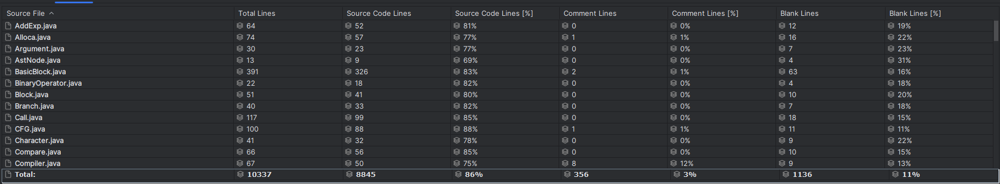

# 总结感想

22371103 王鹏

经过一个学期的学习，编译技术课程也最终落下帷幕。回首一个学期的理论学习，再到动手实现一个编译器，着实感觉有些不可思议。从源代码的词法分析开始，到语法分析、语义分析并生成中间代码，再到代码生成，最后实现优化。近万行的代码也是我进入大学以来单人开发最长的代码，并且也是我完成的第一个工程性质的项目。

让我印象深刻的部分是在生成中间代码和代码优化部分。生成中间代码的阶段，我选择使用LLVM IR作为中间代码。学习LLVM的过程让我印象非常深刻，光是理解定义-使用链就花费了我近一周的时间——是的，我是先花时间充分理解LLVM的结构，查阅LLVM的官方文档说明，查阅LLVM相关博客，在脑海中构建LLVM的结构，然后才开始动手实现中间代码生成。这一个过程虽然时间很长，在忙碌且有限的大三看起来很不划算，但这一过程中首先让我充分理解了LLVM，其次培养了一个良好的学习思维链——先查阅，再理解，最后动手实践。

在代码优化部分，我也充分运用了这样的学习思维，充分理解理论课老师讲述的优化方法，并查阅相关资料甚至是论文原文（GVN-GCM的论文原文啃下来是很有成就感的），最后再动手实践。可是算法讲起来容易，真正实践又又不一样的地方。而且因为每个人的实现不同，算法可能还需要各自修正，否则优化的结果就是WA。写优化的同时正好又是数据库、安卓等课程的大作业ddl，过程不可谓不痛苦。但最终我还是抽出时间坚持了下来，促使我最终完成这些优化的信念是我想把我所学的东西转化成实践，我想动手完成整个项目，不管最后的竞速排名是多少，我只是想尽可能实践我的所学。虽然最后还是有个别优化没能实现，但我想如果有时间，即使课程结束了，我可能仍然会选择继续完善并开源我的编译器。

总的来说，编译技术课程是一次充实且富有挑战的学习经历。我不仅学到了编译原理和相关算法，还培养了系统思考和解决问题的能力。感想很短，纪念这一学期的编译实验，记我的一次小项目的实现。

——写于编译理论考试结束的下午